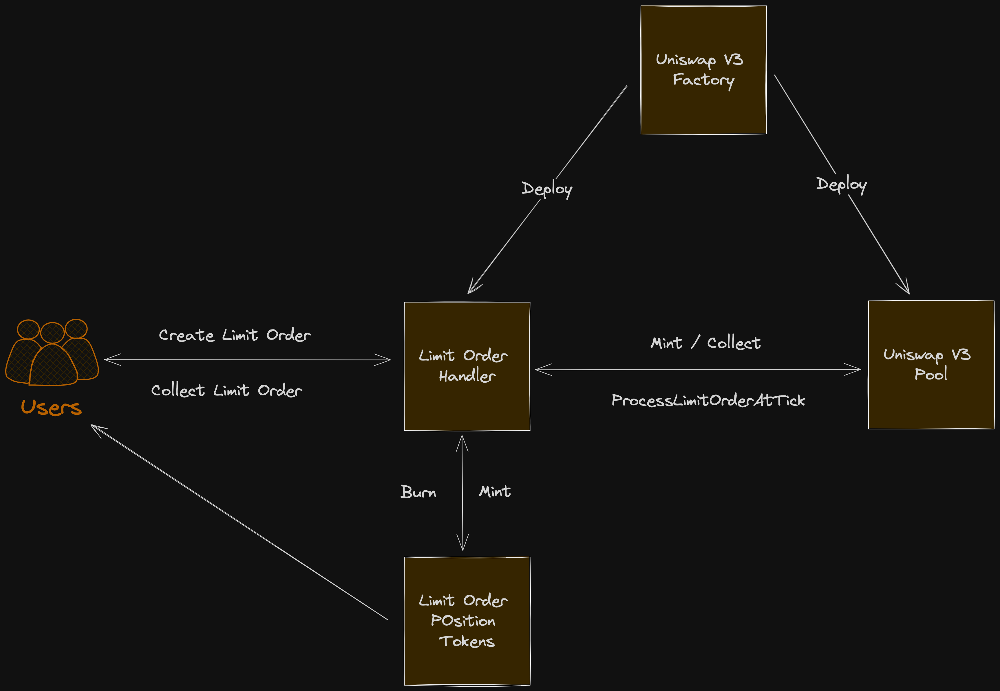

# Uniswap V3 Limit Orders ( Automated Range Orders )

This repo is a demo of Uniswap V3 Limit Orders that are "collected" automatically. Limit Orders in the context of Uniswap V3 aare also known as Range orders.

With Uniswap V3, one can approximate a limit order by providing a single asset as liquidity within a specific range. Like traditional limit orders, range orders may be set with the expectation they will execute at some point in the future, with the target asset available for withdrawal after the spot price has crossed the full range of the order.

However, One important distinction: range orders, unlike traditional limit orders, will be unfilled if the spot price crosses the given range and then reverses to recross in the opposite direction before the target asset is withdrawn. While you will be earning LP fees during this time, if the goal is to exit fully in the desired destination asset, you will need to keep an eye on the order and either manually remove your liquidity when the order has been filled or use a third party position manager service to withdraw on your behalf.

The goal of this repository is to create the range orders on top of Uniswap V3 pool that gets collected automatially. While swapping, when the spot price crosses the given tick, it will automatically fill the order and remove the liquidity.

_Note: To achieve this, Uniswap V3 Pool contract has been altered slightly._

## Architecture Diagram



## How it works

1. Users can create limit orders via the contract LimitOrdersHandler.sol.
2. Unique LimitOrderHandler contract is associated with a pool. UniswapV3PoolFactory exposes a function for the owner to deploy the LimitOrderHandler contract for a pool.
3. Each LimitOrderHandler contract also has a LimitOrderPositionToken ERC-1155 collection associated with it.
4. This collection is deployed by the LimitOrdersHandler contract in the constructor.
5. Whenever user creates the Limit Order at a particular tick, LimitOrderHandler contract adds the liquiidity to the pool via the mint.
6. Limit Order creator is issued ERC-1155 tokens equal to the amount of base asset that was added to the pool.
7. Users can now 'collect' the limit order anytime.
8. If order is collected before its filled, user gets the base tokens that were commited.
9. If the order is collected after its filled, user gets the quote tokens that are received by the contract when the position is removed.
10. In the pool, when the sqrtPriceX96 cross the given tick, it triggers the LimitOrderHandler contract.
11. If there are any active positions opended by the LimitOrderHandler against that tick, it is automatically collected and relevant states are updated.

## Contract Specifications and Changes

### UnsiwapV3Factory

- `updateLimitOrdersHandlerForPool` function is added.
- This function can only be called by the pool owner.
- So that limit order creation can be enabled for the specific pools if required.
- If needed, in future, this function can be made permissionless by integrating with `UniswapV3PoolDeployer`.

### UniswapV3Pool

- Contract now was a function to update the LimitOrderHandler contract instance. This function is `onlyFactoryOwner`.
- In the Swap function, when the 'state.tick' is processed and step.ticknext is reached, before that, it triggers the `processLimitOrdersAtTick` for the ticknext.

### LiimitOrderPositionTokens

- This is ERC-1155 contract that is associated with each unique LimitOrderHandler contract.
- Each TokenId in this contract is associated with a position opened by the LimitOrderHandler contract at a particular tick.
- ERC-1155 is also Burnable, Supplyable, Mintable.

### LimitOrdersHandler

- This is the main contract and is the hero in the repository. Detailed workings of this contract is exposed below for reference.

## LimitOrderHandler Specification

### LimitOrderHandler Metadata

LimitOrder = Position on Uniswap V3. So this Struct tracks the metadata of the position and thereby the limit order.
Base Asset = Asset being commited, Quote Asset = Asset being received.

```
 //
    struct LimitOrderMetadata {
        uint tokenid; // Token id for LimitOrdersTokens contract
        address quoteAsset; // Token to buy
        address baseAsset; // Token to sell
        int24 tickLower;
        int24 tickUpper;
        uint256 amountBaseAssetCommitted; // Total amount of base asset committed to this order
        uint256 amountQuoteAssetReceived; // Total amount of quote asset received from this order
        bool isAboveSpotTick; // Is the order above or below the current tick
        bool isOrderFilled; // Is the order filled
        uint filledAtNonce; // The nonce at which the order was filled
        uint quoteAssetBalance; // The quote asset balance after it is received.
    }
```

### OrderId

OrderId for the Limit Order is calcualted using:
`orderId = keccak256(abi.encodePacked(tick, tickToNonce[tick]));`

Nonce for each tick is maintained. This is required because after the spot price crosses a tick and existing Limit Order is filled, it can come back to that price tick again in future. So a same tick can have distince Limit Orders / Positions active. To dinstinguish, between them, we need the nonce.

### CreateLimitOrder

- Get the current tick and check if the order is above or below the current tick and not at the current tick.
- Calcualte Id Of the LimitOrderMetadata
- If the first order for this id, initialize the metadata
- Update the total base amount commited.
- Mint the Position Tokens for the tokenId / LimitOrderMetadat to the user.
- Mint the position in the Uniswap V3 pool

### CollectLimitOrder

- Function called by the user at any time.
- If its called before the order is filled, then the commited base amount is returned.
- If its called after the order is filled, then the quote amount that us acquored after colelcting the position is returned.
- Formular used for calculating the amounts:

```
    shares  = balannce of Position tokens / Total supply of position tokens
    amountQuoteAssetReceived = shares * total quote asset received after the order is filled.
    amountBaseAssetCommitted = shares * total base asset commited before the order is filled.
```

The code is heavily documented. For further explaination please go through the code.

## Things Remaining:

- The biggest feature that we need to add is fee management. The liquidity that is supplied at a Tick is also earning the fees. Now we need way to access this fee. Either portion of that fees should be given to Limit order owners and the rest can be taken as a protocol fee by the contract owner.
- Posittion Tokens use solidity version 0.8.20. But rest of the code uses v0.7.6. Solidity compiler should be unified to avoid some redunduant files that are used atm.
- The way LimitOrderHandler deploys Position Tokens is not standard. It should dynamically calculat bytecode. But solidity version mismatch makes it tedious. Again, using the single solidity compiler ( latest preferably ) will avoid this.
- Test Cases and End to End testing. This is just he POC code.
- Scenario scripts
- Gas Optimization: Code has been writen the short span of time. it can further be optimized e.g. Variable packing for structs. Also the carefully using the datatypes.
- This is POC. But to get it work with real Uniswap V3, we need to work aith Gelato like services to colelct our positions from Unioswap V3 pool.
